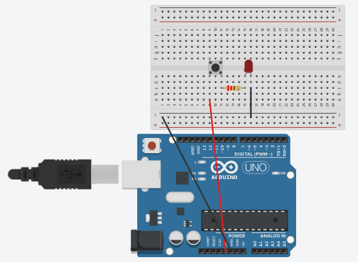

# 💡 LED Controlé avec Button poussoir

  

### 📌 Description
Ce projet est une introduction pratique à l'électronique et à la programmation en **C/C++** sur Arduino. L'objectif est de contrôler l'état d'une LED (ON/OFF) à l'aide d'un bouton poussoir. 

### 🛠️ Matériels nécessaire
* **Microcontrôleur :** Arduino Uno
* **LED :** 1x LED (Rouge)
* **Résistance :** 1x 220 Ohms (pour la LED)
* **Input :** 1x Bouton poussoir
* **Breadboard & Jumpers**

---

### ⚙️ Comment ça fonctionne ?
1. **Circuit :** Le bouton est configuré comme une entrée (INPUT).
2. **Logic :** Le programme surveille l'état du bouton en temps réel.
3. **Action :** Lorsqu'on appuie sur le bouton, le signal passe au niveau HAUT (HIGH), ce qui ferme le circuit et allume la LED.
