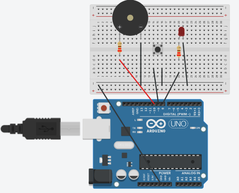

# 🔔 Sonnette avec un bouton

  

### 📌 Description
Ce projet consiste à créer une sonnette interactive. Lorsqu'on appuie sur le bouton poussoir, deux actions sont déclenchées simultanément :
1. Une **alerte sonore** via le Buzzer.
2. Un **retour visuel** via l'allumage d'une LED.

---

### 🛠️ Matériels nécessaire
* **Microcontrôleur :** Arduino Uno
* **Son :** 1x Piezo Buzzer
* **Lumière :** 1x LED (Rouge)
* **Input :** 1x Bouton poussoir
* **Résistances :** 2x 220 Ohms (pour la LED et le Buzzer)
* **Breadboard & Jumpers**

---

### ⚙️ Comment ça fonctionne?
Le programme utilise une structure conditionnelle simple :
* **État au repos :** La LED est éteinte et le buzzer est silencieux.
* **État actif :** Dès que le bouton est pressé, la LED s'allume et le buzzer fait un son.

---

### 📁 Code
* **Le code se trouve ici : 
